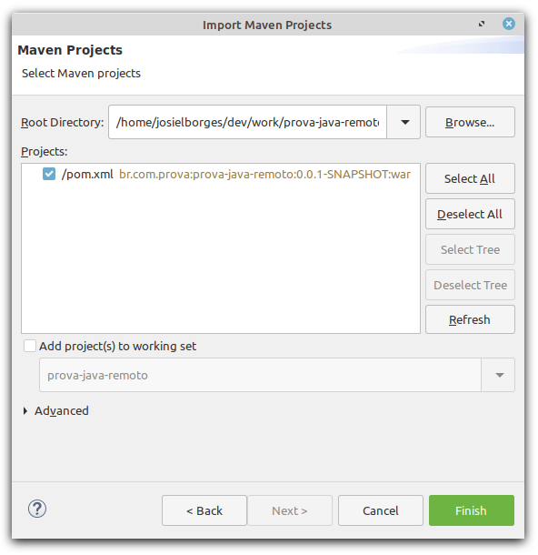
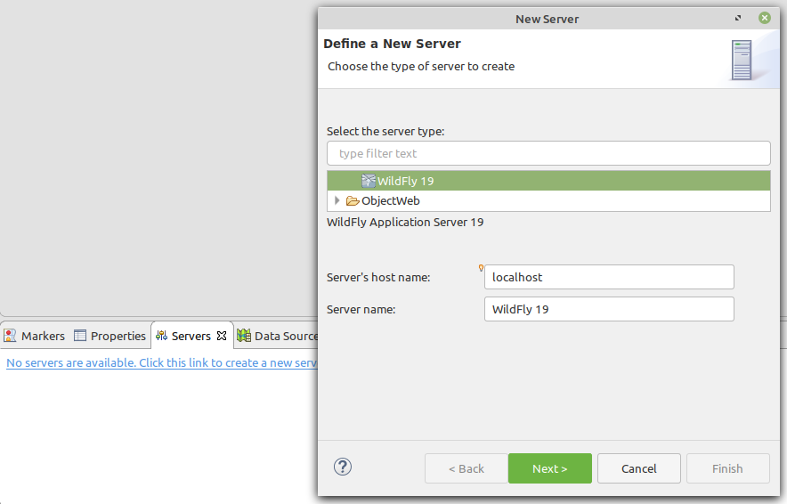
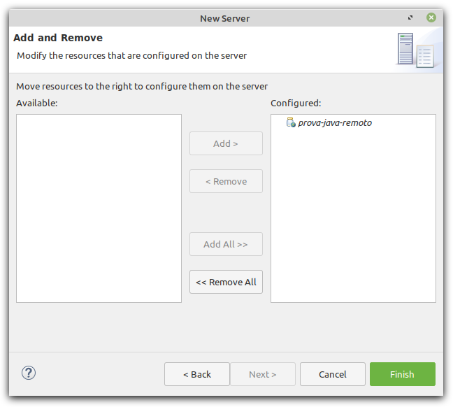
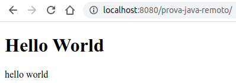
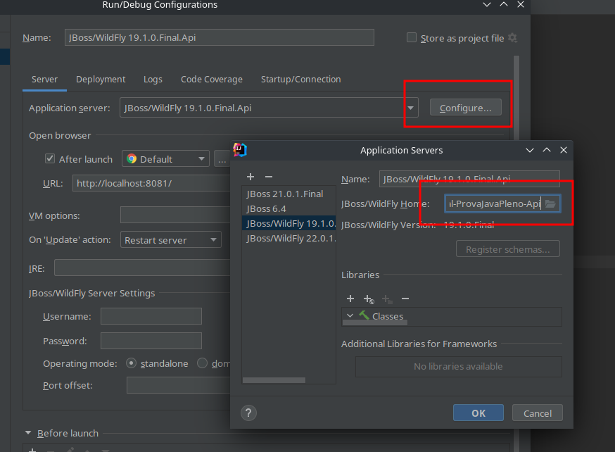
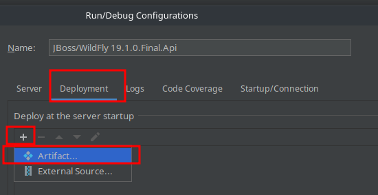
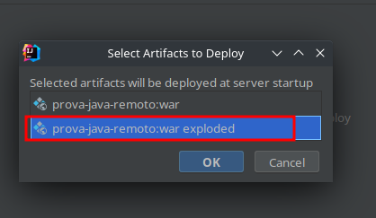
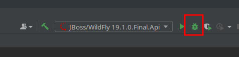

# Prova Java PLENO SD - WEB - Configuração

O desenvolvimento da prova consiste em desenvolver telas(s) conforme especificado, em protótipos enviados por e-mail.

Pode, ou não, haver integrações entre API criada pelo canditato, ou API externa. 

O projeto da prova utiliza a linguagem JAVA EE (CDI, JPA, JSF, Managed Beans, etc).
A única lib extra que está configurada para utilização é o Primefaces.

Alguns pontos em relação ao desenvolvimento: 
- Fique a vontade para adicionar mais libs, caso ache necessário. No entanto, essas devem ser adicionada ao projeto via maven (no arquivo pom.xml)
- A criação das tabelas, no banco de dados, são de forma automática, dependendo do que está modelado nas entidades. 
- Os arquivos de exemplo, do hello world, estão todos numa pasta. No entanto, organize os arquivos do projeto de uma forma adequada (MVC).
- Descreva ao final deste documento (Readme.md) o detalhamento de funcionalidades implementadas, sejam elas já descritas na modelagem e / ou extras.
- Detalhar também as funcionalidades que não conseguiu implementar e o motivo.
- Caso tenha adicionado novas libs, descreva quais foram e porque dessa agregação.
- As alterações realizadas na prova deve ser comitada diretamente na master/main do repositório, e não deve estar zipado.
- Caso ocorrer algum problema ao utilizar o banco no docker, pode-se utilizar sem o docker.

No mais, desenvolva com qualidade e boa prova :)
## Versão JDK

Utilizar a versão mais recente.

## Download da IDE

Baixar e descompactar o Eclipse:

- [Windows][eclipse-windows]
- [Linux][eclipse-linux]
- [Mac][eclipse-mac]

Iniciar o Eclipse escolhendo uma worksplace de sua preferência.

*Fique a vontade para usar outras IDE, com o IntelliJ ou VSCode.*

## Download do Servidor de aplicação 

Fazer o download do servidor de aplicação (Wildfly) pré-configurado em [aqui][wildfly-link] e extrair em um local apropriado.

## Clone do repositório do projeto

Clonar esse repositório dentro da pasta do workspace utilizado no Eclipse.

## Clone do repositório do banco de dados

Instalar o docker: https://www.docker.com/get-started > Docker Desktop

O banco de dados é criado via docker e o fonte está disponível em https://github.com/SENAI-SD/prova-java-remoto-banco

Apos o clone, ir via terminal na pasta extraida e executar o banco pelo docker: `docker-compose up -d`

OBS: Se atentar que não pode haver nenhum servidor postgres rodando na máquina, se tiver, necessário fechar todos os serviços, assim como
qualquer outro serviço que esteja utilizando a porta 5432 (ou trocar a porta no arquivo docker-compose.yaml da aplicação prova-java-remoto-banco). Para verificar se o docker subiu corretamente, realizar a conexão com o banco:
- host: localhost
- port: 5432
- database: ist
- user: ist
- password: ist

## Configuração da IDE

### Eclipse

- Ir em "File > Import..." e escolher a opção conforme segue:

  

- Selecionar a pasta do projeto e confirmar como segue:

  

- Em *Select root repository* escolher a pasta do projeto e clicar em *Finish*.
- Ir no menu "Window > Preferences" e Adicionar um novo *Runtime Environment* conforme segue:

  

  - Nesse momento será feito o download dos arquivos necessários para que o *Ecplise* consiga usar o servidor de aplicação Wildfly.
  - A instalação será feita em segundo plano (verificar barra de status).
  - Confirmar, caso haja, alguma tela de confirmação e reiniciar o *Eclipse ao final do processo*.

- Na aba "Servers" clicar em *No server are available. Click this link to create a new server...* como segue:

  

- Na etapa de criação do servidor, selecionar a pasta do servidor baixado anteriormente. Como por exemplo:

  
  
- Na próxima etapa, adicionar o projeto ficando dessa forma:
  
  

- Finalizar em *Finish*.

- Subir o servidor em modo *Debug* no botão à seguir:

  

- No navegador digitar http://localhost:8080/prova-java-remoto/, irá mostrar uma tela inicial com **Hello Word**:

  

### IntelliJ

- Ir em File -> New -> Project from Existing Sources...

- Selecionar o arquivo pom.xml, na raiz do projeto

- Adicionar uma nova configuração

  

- Selecionar a pasta do servidor

  

  *Note que essa configuração pode conflitar com o repositorio API. Assim, basta mudar o nome do Server.*

  *O caminho do servidor muda de acordo com o local baixado, e nome da pasta. Nesse caso, deveria ser ..../wildfly-19.1.0.Final-ProvaJavaPleno-Web*

- Adicionar o artefato

  

  

- Selecionar Exploded

  

- No navegador digitar http://localhost:8081/prova-java-remoto/hellow-world, irá mostrar a mensagem **Hello Word**.

### Funcionalidades Implementadas
Aqui está um detalhamento das funcionalidades implementadas neste projeto, baseadas nas regras R1 a R6 e as funcionalidades extras adicionadas.

## Requisitos Implementados
R1 - Cadastro de Pessoa e Endereço
Implementamos o cadastro de uma Pessoa com informações como nome, data de nascimento, CPF e e-mail.
Ao cadastrar uma Pessoa, também cadastramos um Endereço associado a ela, contendo informações como CEP, rua, número, cidade e estado.

R2 - Atualização de Pessoa e Endereço
Implementamos a funcionalidade de atualização das informações de uma Pessoa e seu Endereço associado.
A atualização é realizada através do CPF da Pessoa.

R3 - Busca de Pessoa por CPF
Implementamos a funcionalidade de busca de uma Pessoa pelo seu CPF.
A busca retorna as informações da Pessoa e seu Endereço associado.
R4 - Listagem de todas as Pessoas

Implementamos a funcionalidade de listar todas as Pessoas cadastradas no sistema.
A listagem retorna as informações de todas as Pessoas e seus Endereços associados.

R5 - Exclusão de Pessoa por CPF
Implementamos a funcionalidade de exclusão de uma Pessoa pelo seu CPF.
A exclusão remove a Pessoa e seu Endereço associado do sistema.

### Funcionalidades Não Implementadas
Infelizmente, não consegui implementar as seguintes funcionalidades e requisitos do projeto:

R6 - Validação dos dados de entrada
Implementamos a validação dos dados de entrada para garantir a consistência das informações cadastradas no sistema.
Funcionalidades Extras

R7 - Listagem de pessoas em diante
O codigo acabou ficando muito baguncado e deixando de seguir qualquer padrao de projeto, por isso nao consegui implementar essas funcionalidades.
Integrar a API do CEP foi facil, criei a API propria no outro repositorio mesmo nunca tendo tido contato com Java EE/JSF antes, fiquei surpreso com o tempo
que levei para conseguir implementar um CRUD basico, mas acho que o tempo que levei para aprender a usar o Java EE/JSF foi o que mais me atrapalhou.
A API esta solida, e com uma certa organizacao, acabei desrespeitando um pouco o SRP mas acho que o codigo esta bem legivel e facil de entender.
Acho que aprendi bastante coisa e me sinto mais confortavel agora, minha experiencia de trabalho consiste em desenvolvimento de API's em NodeJS e front Vanilla/React, seja
Javascript ou Typescript, e acho que o Java EE/JSF tem um potencial enorme, minha unica experiencia de trabalho com Java foi quando estagiario com Spring e JPA, focado somente no backend.
Onde tive muito mais facilidade do que aqui, tentei avancar algumas funcionalidades para pontuar mais mas como ja estamos proximos do tempo final e falta muita implementacao e nao consegui nem ver
a Java Message Service entao irei finalizar por aqui. 
Tenho muita vontade de voltar pro Java, o mercado me jogou em NodeJS,React, DevOps.
Nao apliquei unit tests com JUnit pois tentei usar o tempo para as funcionalidades, somando sabado e domingo eu dediquei cerca de 14 horas para instalar o ambiente, ver os requisitos,
aprender a usar o Java EE/JSF e implementar as funcionalidades. 

[eclipse-windows]: https://www.eclipse.org/downloads/download.php?file=/technology/epp/downloads/release/2020-03/R/eclipse-jee-2020-03-R-incubation-win32-x86_64.zip

[eclipse-linux]: https://www.eclipse.org/downloads/download.php?file=/technology/epp/downloads/release/2020-03/R/eclipse-jee-2020-03-R-incubation-linux-gtk-x86_64.tar.gz

[eclipse-mac]: https://www.eclipse.org/downloads/download.php?file=/technology/epp/downloads/release/2020-03/R/eclipse-jee-2020-03-R-incubation-macosx-cocoa-x86_64.dmg

[wildfly-link]: https://drive.google.com/file/d/1sM7gDAFIHGaHdFwlcUqs6lZprwsuH_Dn/view?usp=sharing
