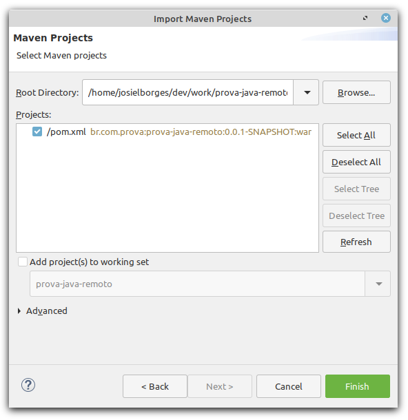
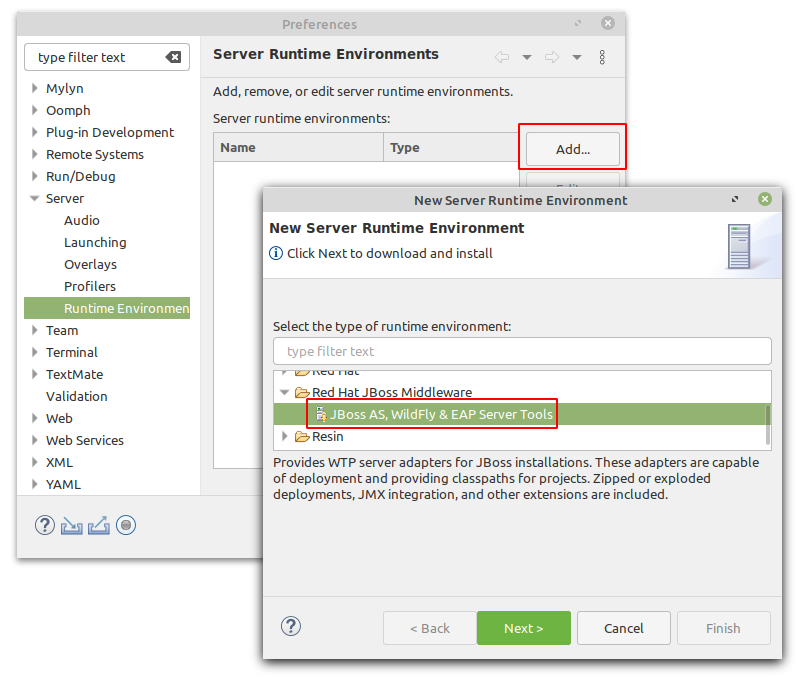
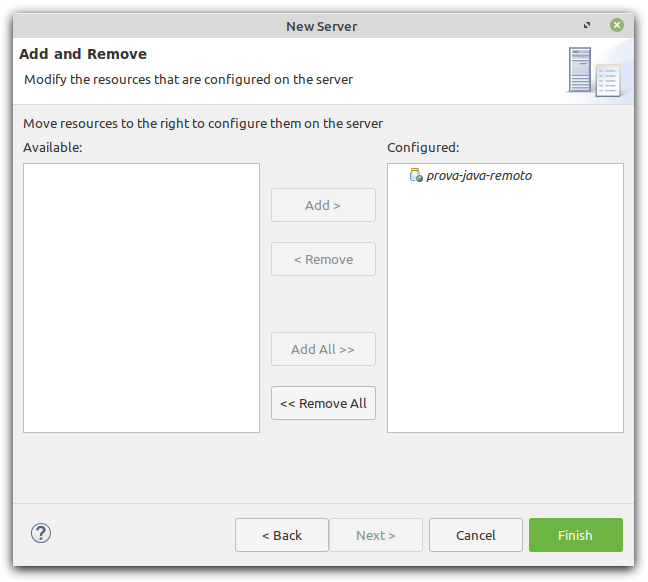
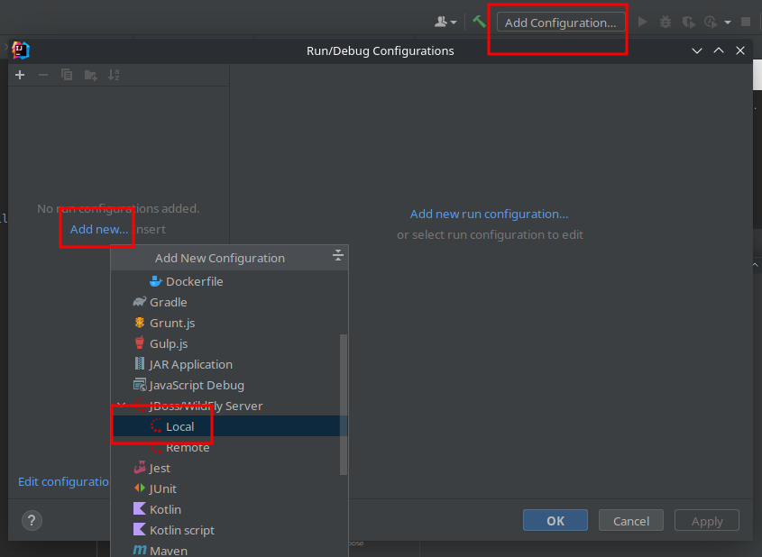
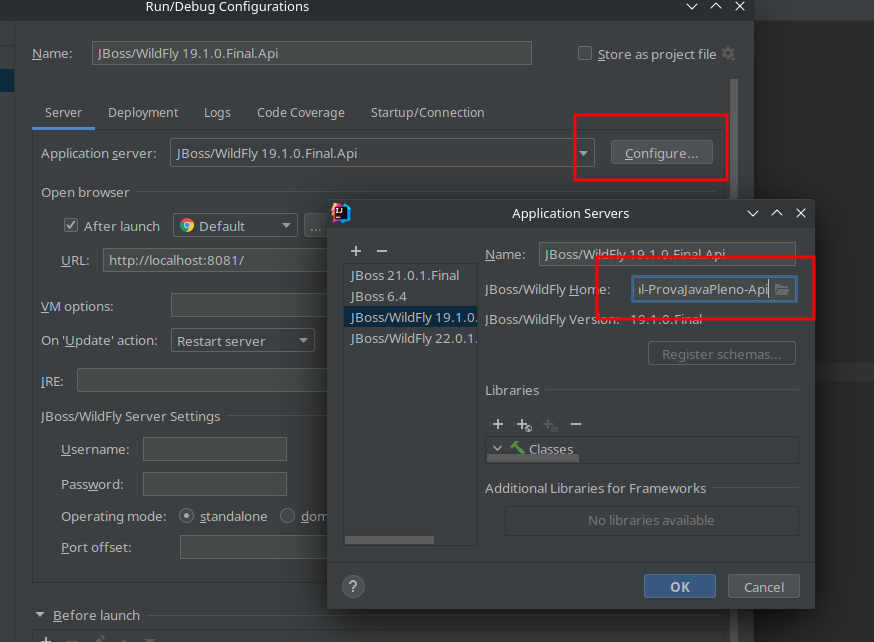
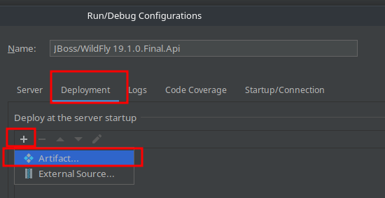
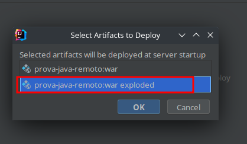
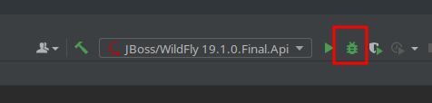

# Prova Java PLENO SD - API - Configuração

O desenvolvimento da prova consiste em desenvolver telas(s) conforme especificado, em protótipos enviados por e-mail.

Pode, ou não, haver integrações entre API criada pelo canditato, ou API externa. 

O projeto da prova utiliza a linguagem JAVA EE (CDI, JPA, JSF, Managed Beans, etc).
A única lib extra que está configurada para utilização é o Primefaces.

Alguns pontos em relação ao desenvolvimento: 
- Fique a vontade para adicionar mais libs, caso ache necessário. No entanto, essas devem ser adicionada ao projeto via maven (no arquivo pom.xml)
- A criação das tabelas, no banco de dados, são de forma automática, dependendo do que está modelado nas entidades. 
- Os arquivos de exemplo, do hello world, estão todos numa pasta. No entanto, organize os arquivos do projeto de uma forma adequada (MVC).
- Descreva ao final deste documento (Readme.md) o detalhamento de funcionalidades implementadas, sejam elas já descritas na modelagem e / ou extras.
- Detalhar também as funcionalidades que não conseguiu implementar e o motivo.
- Caso tenha adicionado novas libs, descreva quais foram e porque dessa agregação.
- As alterações realizadas na prova deve ser comitada diretamente na master/main do repositório, e não deve estar zipado.
- Caso ocorrer algum problema ao utilizar o banco no docker, pode-se utilizar sem o docker.

No mais, desenvolva com qualidade e boa prova :)
## Versão JDK

Utilizar a versão mais recente.

## Download da IDE

Baixar e descompactar o Eclipse:

- [Windows][eclipse-windows]
- [Linux][eclipse-linux]
- [Mac][eclipse-mac]

Iniciar o Eclipse escolhendo uma worksplace de sua preferência.

*Fique a vontade para usar outras IDE, com o IntelliJ ou VSCode.*

## Download do Servidor de aplicação 

Fazer o download do servidor de aplicação (Wildfly) pré-configurado em [aqui][wildfly-link] e extrair em um local apropriado.

## Clone do repositório do projeto

Clonar esse repositório dentro da pasta do workspace utilizado no Eclipse.

## Clone do repositório do banco de dados

Instalar o docker: https://www.docker.com/get-started > Docker Desktop

O banco de dados é criado via docker e o fonte está disponível em https://github.com/SENAI-SD/prova-java-remoto-banco-api

Apos o clone, ir via terminal na pasta extraida e executar o banco pelo docker: `docker-compose up -d`

OBS: Se atentar que não pode haver nenhum servidor postgres rodando na máquina, se tiver, necessário fechar todos os serviços, assim como
qualquer outro serviço que esteja utilizando a porta 5433 (ou trocar a porta no arquivo docker-compose.yaml da aplicação prova-java-remoto-banco). Para verificar se o docker subiu corretamente, realizar a conexão com o banco:
- host: localhost
- port: 5433
- database: ist-api
- user: ist
- password: ist

## Configuração da IDE

### Ecplipse

- Ir em "File > Import..." e escolher a opção conforme segue:

  

- Selecionar a pasta do projeto e confirmar como segue:

  

- Em *Select root repository* escolher a pasta do projeto e clicar em *Finish*.
- Ir no menu "Window > Preferences" e Adicionar um novo *Runtime Environment* conforme segue:

  

  - Nesse momento será feito o download dos arquivos necessários para que o *Ecplise* consiga usar o servidor de aplicação Wildfly.
  - A instalação será feita em segundo plano (verificar barra de status).
  - Confirmar, caso haja, alguma tela de confirmação e reiniciar o *Eclipse ao final do processo*.

- Na aba "Servers" clicar em *No server are available. Click this link to create a new server...* como segue:

  

- Na etapa de criação do servidor, selecionar a pasta do servidor baixado anteriormente. Como por exemplo:

  

  *Note que essa configuração pode conflitar com o repositorio WEB. Assim, basta mudar o nome do Server.*

  *O caminho do servidor muda de acordo com o local baixado, e nome da pasta. Nesse caso, deveria ser ..../wildfly-19.1.0.Final-ProvaJavaPleno-Api*
  
- Na próxima etapa, adicionar o projeto ficando dessa forma:
  
  

- Finalizar em *Finish*.

- Subir o servidor em modo *Debug* no botão à seguir:

  

- No navegador digitar http://localhost:8081/prova-java-remoto/hellow-world, irá mostrar a mensagem **Hello Word**.

### IntelliJ

- Ir em File -> New -> Project from Existing Sources...

- Selecionar o arquivo pom.xml, na raiz do projeto

- Adicionar uma nova configuração

  

- Selecionar a pasta do servidor

  

  *Note que essa configuração pode conflitar com o repositorio WEB. Assim, basta mudar o nome do Server.*

  *O caminho do servidor muda de acordo com o local baixado, e nome da pasta. Nesse caso, deveria ser ..../wildfly-19.1.0.Final-ProvaJavaPleno-Api*

- Adicionar o artefato

  

  

- Selecionar Exploded

  

- No navegador digitar http://localhost:8081/prova-java-remoto/hellow-world, irá mostrar a mensagem **Hello Word**.

### Funcionalidades implementadas

1.Adicionado CRUD completo para a entidade Pessoa, incluindo a criação, atualização, exclusão e recuperação de informações.
2.Implementado endpoint para buscar Pessoa por CPF e todos endpoints com os responses requisitados.
3.Adicionado tratamento de exceções e respostas personalizadas para diferentes cenários de erro, como Pessoa não encontrada (404) e erros genéricos (500).

### Bibliotecas adicionadas
Jakarta JSON Binding (JSON-B) - Adicionada para facilitar a conversão de objetos Java em JSON e vice-versa, melhorando a interoperabilidade da API com outras aplicações.

### Endpoints

POST createPessoa
URL: http://localhost:8081/prova-java-remoto/pessoas
Payload:
{
"nome": "Joao Bione",
"nascimento": "1994-01-01",
"cpf": "15816746782",
"email": "fulano@email.com",
"endereco": {
"cep": "123456789",
"rua": "Rua ABV",
"numero": 100,
"cidade": "Rio Del Janeiro",
"estado": "RJ"
}
}

PUT updateData
URL: http://localhost:8081/prova-java-remoto/pessoas?cpf=15816746782
Payload:
{
"nome": "JoaoBione",
"nascimento": "1984-03-02",
"cpf": "15816746783",
"email": "fulano@gemail.com",
"endereco": {
"cep": "12345678",
"rua": "Rua AB",
"numero": 99,
"cidade": "Rio Janeiro",
"estado": "SP"
}
}

GET getByCPF
URL: http://localhost:8081/prova-java-remoto/pessoas/?cpf=15816746783

GET getAll
URL: http://localhost:8081/prova-java-remoto/pessoas/all

DELETE deleteData
URL: http://localhost:8081/prova-java-remoto/pessoas/?cpf=15816746783

Aqui estao os Endpoints com exemplo de payload.

[eclipse-windows]: https://www.eclipse.org/downloads/download.php?file=/technology/epp/downloads/release/2020-03/R/eclipse-jee-2020-03-R-incubation-win32-x86_64.zip

[eclipse-linux]: https://www.eclipse.org/downloads/download.php?file=/technology/epp/downloads/release/2020-03/R/eclipse-jee-2020-03-R-incubation-linux-gtk-x86_64.tar.gz

[eclipse-mac]: https://www.eclipse.org/downloads/download.php?file=/technology/epp/downloads/release/2020-03/R/eclipse-jee-2020-03-R-incubation-macosx-cocoa-x86_64.dmg

[wildfly-link]: https://drive.google.com/file/d/1eQJ22OhbX0MAHQRdftBjyQbrPlocGqSo/view?usp=sharing
